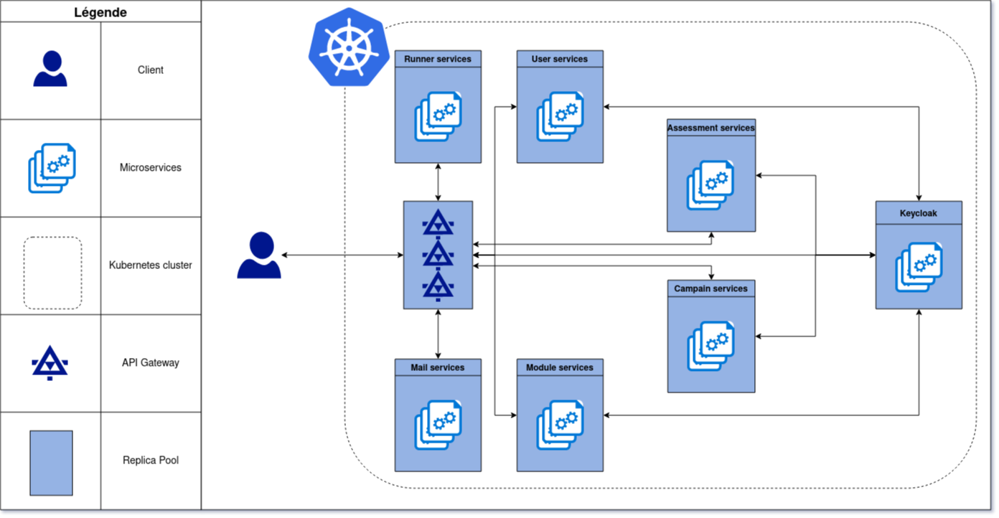

= Document d'architecture technique
Yann POMIE <yann.pomie@etu.umontpellier.fr>
v0.0.1, 02-11-2022
:toc:
:homepage: https://polycode.do-2021.fr/

<<<
== Q1: En partant des pré-requis, que proposez-vous comme séparation en quartiers fonctionnels de votre application et en termes de micro-services?

=== Vocabulaire métier et user stories
Suite à de nombreuses incompréhensions, nous avons redéfini une grande partie du vocabulaire métier, nous en avons aussi profité pour redéfinir nos user stories. 

Voici les définitions du vocabulaire métier que vous serez succesptible de trouver dans nos user stories

* *Invité* : Client n'ayant pas de compte sur la plateforme 
* *Utilisateur* : Client ayant un compte sur la plateforme
* *Administrateur* : Utililisateur privilégié ayant des droits CRUD sur toutes les ressources de la plateforme
* *Équipe* : Regroupement d'utilisateurs composé d'un capitaine et de membres
* *Évaluation* : Une évaluation destinée à des utilisateurs
* *Test* : Il s'agit d'un groupe ordonné de contenus, noté, conçu pour évaluer les utilisateurs. Il est créé par un créateur d'évaluation.
* *Candidat* : Utilisateur participant à une évaluation ou a un test
* *Campagne de tests* : exposition d'un groupe utilisateurs à un test
* *Composant* : Élémént affiché à l'utilisateur, il peut s'agir de markdown, d'un éditeur de code etc...
* *Contenu* : Ensemble cohérent de composants
* *Module* : Un groupement de contenus, peut également contenir d'autres modules appelés sous-modules 
* *PolyPoints* : Points gagnés par les utilisateurs lorsqu'ils réussissent des défis de composant
* *Validateur* : Élément caché de l'utilisateur, associé à un composant, il permet de vérifier la validité des réponses de l'utilisateur et récompense les bonnes réponses avec des PolyPoints.

[cols="1,2,2"]
|===
|En tant que...|Je veux...|Afin de...

|Invité
|Créer un compte
|D'utiliser l'application

|Invité
|Créer un compte avec un compte Google/Polytech
|D'utiliser l'application sans avoir à créer un mot de passe et sans avoir à saisir mes informations personnelles

|Utilisateur
|Mettre à jour mes adresses mails 
|Pour récupérer mon compte en cas de perte de mot de passe ou en cas de problèmes d'email

|Utilisateur
|Recevoir un mail lors de bienvenue après inscription
|Être averti que mon inscription à bien été faite

|Utilisateur
|Changer mon nom, mon mot de passe, mon language de programmation et ma bio
|Mes informations personelles soient à jour

|Utilisateur 
|Delete my account 
|Ne plus avoir de trace sur l’application 

|Utilisateur 
|Me connecter grâce une adresse mail et un mot de passe/grâce à un compte Google ou Polytech
|Je puisse accèder à toutes les fonctionnalités de l’application 

|Utilisateur 
|Me déconnecter de mon compte
|Éviter les accès non autorisés depuis le navigateur utilsé. 

|Utilisateur 
|Récupérer mon mot de passe via un mail
|Je puisse récupérer mon compte en cas de perte de mon mot de passe

|Utilisateur 
|Créer une nouvelle équipe
|Réunir un groupe d’utilisateurs et parciper au leaderboard des équipes (somme des points de chaque utilisateur).

|Capitaine 
|Invite d'autres utilisateurs à être membre de mon équipe
|Mon équipe s’agrandisse

|Capitaine
|Exclure un membre de mon équipe
|Enlever un membre problématique / non actif / qui n’est plus en adéquation avec le groupe.

|Capitaine 
|Donner le rôle de capitaine à un autre membre de mon équipe
|Je sois disposé de ces fonctions

|Capitaine
|Supprimer mon équipe
|Ne plus avoir de traces de cette équipe, pour quelconque raison. 

|Capitaine 
|Changer le nom et la description de mon équipe 
|Les informations de l’équipe reste à jour

|Utilisateur
|Accepter ou décliner une invitation à une équipe 
|Ajoute les PolyPoints (précédents) et gagnés de l’utilisateur à l’équipe

|Utilisateur 
|Pouvoir quitter une équipe
|Je ne sois plus associé à un groupe d’utilisateur

|Utilisateur
|Voir les points de mon équipe
|Constater l’avancement des membres de l'équipe

|Utilisateur
|Voir le classement des équipes
|Je vois le placement de mon équipe vis-à-vis des autres 

|Utilisateur
|Voir le classement interne des membres de l’équipe
|Voir qui a participé le plus dans l’équipe, concurrence interne

|Utilisateur
|Voir la liste des exercices disponibles
|Je puisse choisir un exercice à faire 

|Utilisateur
|Voir la liste des modules disponibles
|Je puisse choisir un module à faire 

|Utilisateur
|Voir les sous-modules et les exercices d’un module 
|Trouver les étapes à faire pour compléter le module

|Utilisateur 
|Voir la liste des évaluations disponibles 
|Je puisse choisir une évaluation à passer 

|Utilisateur 
|Voir les derniers exercices / modules mis en ligne
|Voir le nouveau contenu 

|Utilisateur 
|Voir les informations d’un exercice 
|M’informer sur le sujet d’un exercice 

|Utilisateur 
|Voir les informations d’un module 
|M’informer sur le sujet du module, l’objectif 

|Utilisateur 
|Voir les informations d’une évaluation
|M’informer sur le sujet de l’évaluation, l’objectif 

|Utilisateur 
|Voir l’énoncé d’un exercice 
|D'apprendre une nouvelle notion, connaître le problème à résoudre, question à répondre pour valider la notion  

|Utilisateur 
|Proposer une solution à l’exercice 
|Gagner des PolyPoints et avancer dans le module associé 

|Utilisateur 
|Dans le cas d’un code à écrire, exécuter un validateur intermédiaire  
|Vérifier si mon code est correct pour le validateur en question 

|Utilisateur 
|Revoir la dernière solution qui à passée le plus de validateurs 
|Reprendre le code depuis un appareil différent, à un autre moment, pour l’améliorer 

|Utilisateur 
|Écrire (et modifier) sa solution de code dans un éditeur intégré à la page de l’exercice 
|Proposer une solution à l’exercice 

|Utilisateur 
|Ajouter des fichiers dans l’éditeur intégré à la page d’exercice
|Organiser la solution en plusieurs fichiers 

|Utilisateur 
|Supprimer des fichiers dans l’éditeur 
|Organiser la solution en plusieurs fichiers 

|Utilisateur 
|Afficher les données de validateur (entrée et sortie) en échange de avec des PolyPoints
|Comprendre mieux comment résoudre l’exercice 

|Utilisateur 
|Suivre ma progression dans chacun des modules 
|Voir ce qui est complété / à faire  

|Utilisateur 
|Voir le classement global des utilisateurs (par polypoints) 
|Nous motiver à atteindre le sommet (principe de concurrence) 

|Utilisateur 
|Passer une évaluation 
|Obtenir une certification 

|Utilisateur 
|Lire le contenu d’un cours 
|Monter en compétence sur un sujet 

|Créateur de contenu 
|Créer un exercice 
|Proposer l’apprentissage d’une nouvelle notion, faire vérifier la connaissance de cette notion par une question/ un code à écrire 

|Créateur de contenu 
|Créer un module 
|Organiser les exercices par notion majeure / thématique 

|Créateur d'évaluation 
|Créer une évaluation 
|Vérifier les compétence d’un utilisateur sur un contenu 

|Créateur de contenu 
|Ajouter ses exercices à un module qu’il a créé 
|Remplir le contenu d’un module en ensemble d’élément cohérent 

|Créateur de contenu 
|Ajouter des modules dans un module, et ce avec des modules qu’il a créé (sous-module) 
|Remplir le contenu d’un module en ensemble d’élément cohérent 

|Créateur de contenu 
|Modifier le nom, la description, le nombre de PolyPoints de récompense, les tags, le contenu (exercices et sous-module) de ses modules 
|Garder à jour un module 

|Créateur de contenu 
|Modifier le titre, la description, le contenu, récompense en polypoints,  les validateurs, les tags d’un exercice 
|Garder à jour un exercice 

|Créateur de contenu 
|Modifier le titre, la description, le contenu d’une évaluation
|Garder à jour une évaluation 

|Créateur de contenu 
|Supprimer un exercice qu’il a créé 
|Réparer une erreur / ne plus vouloir la présence de ce contenu 

|Créateur de contenu 
|Supprimer un module qu’il a créé 
|Réparer une erreur / ne plus vouloir la présence de ce contenu 

|Créateur de contenu
|Supprimer une évaluation qu’il a créé
|Réparer une erreur / ne plus vouloir la présence de ce contenu 

|Créateur de contenu
|Voir le résultat des utilisateurs sur une évaluation qu’il a créé
|Pour que le recruteur / professeur voie le résultat des élèves pour attribuer une note / recruter 

|Administrateur
|Promouvoir un utilisateur en rédacteur
|Qu’un utilisateur ai les droits d’un “redacteur” 

|Administrateur
|Promouvoir un utilisateur en Administrateur
|Qu’un utilisateur ai les droits d’un “Administrateur” 

|Administrateur
|Créer un utilisateur
|Utiliser l’application avec un autre compte 

|Administrateur
|Récupérer les données d’un utilisateur
|Voir les informations confidentielles d’un compte utilisateur 

|Administrateur
|Mettre à jour les données d’un utilisateur
|Mettre à jour les informations personnelles afin qu’elles soient cohérentes 

|Administrateur
|Supprimer un utilisateur
|Ne plus donner accès à la plateforme pour un compte utilisateur 

|Administrateur
|Créer un exercice
|Proposer l’apprentissage d’une nouvelle notion, faire vérifier la connaissance de cette notion par une question/ un code à écrire 

|Administrateur
|Modifier le titre, la description, le contenu, récompense en polypoints,  les validateurs, les tags d’un exercice
|Garder à jour un exercice 

|Administrateur
|Supprimer un exercice
|Réparer une erreur / ne plus vouloir la présence de ce contenu 

|Administrateur
|Créer un module
|Créer un module afin de regrouper des contenus 

|Administrateur
|Récupérer les données d’un module
|Voir les informations et les contenus associés à ce module 

|Administrateur
|Mettre à jour les données d’un module
|Garde le module à jour 

|Administrateur
|Supprimer un module
|Effacer les traces du module sur la plateforme 

|Administrateur
|Créer une évaluation
|Vérifier les compétence d’un utilisateur sur un contenu 

|Administrateur
|Récupérer les données d’une évaluation
|Voir les différentes données en lien avec une évaluation 

|Administrateur
|Mettre à jour les données d’une évaluation
|Ajouter des utilisateurs ou modifier des données relatives à une évaluation 

|Administrateur
|Supprimer une évaluation
|Enlever une évaluation de la plateforme 

|Administrateur
|Créer une team
|Rassembler des utilisateurs dans une équipe 

|Administrateur
|Ajouter un membre dans mon équipe
|Proposer à un utilisateur de rejoindre mon équipe 

|Administrateur
|Supprimer un membre d’une team
|Enlever un utilisateur de mon équipe pour une quelconque raison 

|Administrateur
|Supprimer une team
|Supprimer une team qui ne valide pas les conditions d’utilisation 

|Administrateur
|Modifier la description d’une équipe
|Avoir une description à jour de l’équipe 

|Créateur d'évaluation
|Créer une campagne de test
|Evaluer le niveau des utilisateurs 

|Créateur d'évaluation
|Ajouter des utilisateurs à ma campagne via une interface web
|Faire participer les candidats 

|Créateur d'évaluation
|Supprimer des utilisateurs à ma campagne via une interface web
|Enlever un candidat des participants 

|Créateur d'évaluation
|Ajouter des utilisateurs à ma campagne via des appels API
|Faire participer les candidats 

|Créateur d'évaluation
|Supprimer des utilisateurs à ma campagne via des appels API
|Enlever un candidat des participants 

|Créateur d'évaluation
|Ajouter des utilisateurs à ma campagne via l’importation de fichiers csv
|Faire participer les candidats 

|Créateur d'évaluation
|Voir les résultats et statistiques sur la campagne que j’ai créé
|Me rendre compte du niveau des candidats testés 

|Créateur d'évaluation
|Ajouter des tags à mes candidats
|Grouper les candidats 

|Créateur d'évaluation
|Définir une date limite pour ma campagne
|Clôturer ma campagne à une date fixe 

|Candidat
|Revenir sur un test et reprendre là où j’en était
|Finir mon test si jamais je quitte l’application 

|Créateur d'évaluation
|Définir un temps limite pour chaque question de ma campagne
|Les candidats répondent dans un temps limité 

|Créateur d'évaluation
|Définir un nb de points pour chaque question
|Avoir un score par candidats et voir leur différence de score à la fin de la campagne 

|Candidat
|Recevoir un mail me permettant de participer à une campagne de tests
|Avoir un lien pour participer à une campagne 

|Candidat 
|Accepter de participer à une campagne 
|Tester ses compétences à travers une campagne 

|Candidat 
|Refuser de participer à une campagne 
|Avoir la possibilité de refuser une campagne et que le créateur en soit informé 

|Créateur d'évaluation 
|Éditer ma campagne, les tests liés 
|Modifier une campagne précédemment créée 

|Créateur d'évaluation 
|Définir une date de début de ma campagne 
|Définir une date pour les candidats, ainsi qu’un temps imparti pour finaliser la campagne 

|Créateur d'évaluation 
|Envoyer des liens de ma campagne manuellement à mes candidats 
|S’assurer que les candidats reçoivent bien le lien pour participer à une campagne 

|Candidat 
|Recevoir un mail de confirmation contenant des stats quand j’ai soumis mon test 
|Notifier l’utilisateur que sa participation et ses réponses ont bien été enregistrées pour une campagne 

|Créateur d'évaluation 
|Voir le nombre de points totaux par candidats 
|Comparer les points des candidats ayant participé à la campagne 

|Créateur d'évaluation 
|Visualiser un graphique/un excel par tags de content et par candidats 
|Voir graphiquement les différents résultats 

|Créateur d'évaluation 
|Exporter les resultats synthetisés dans un pdf 
|Sauvegarder les résultats des candidats et avoir une vue synthétique 

|Créateur d'évaluation 
|Exporter les resultats détaillés dans un pdf 
|Sauvegarder les résultats des candidats et y avoir accès sans passer par l’application 

|Créateur d'évaluation 
|Avoir une vue comparative des candidats sous la forme d’un tableau excel 
|Comparer les score des candidats à travers un tableau 

|Créateur d'évaluation 
|Trier la liste des candidats par tags, resultats 
|Comparer les résultats des candidats en fonction de données précises 

|Créateur d'évaluation 
|Télécharger les scores des candidats 
|Afin de garder les stats en local 
|===

=== Découpage en quartier fonctionnels
En considérant ces users stories on peut en déduire ces quartiers fonctionnels :

. Authentification/Authorisation: permet à l'utilisateur de s'inscrire et de s'identifier sur la plateforme. Vérifie les droits de l'utilisateur sur une ressource.
. Gestion des utilisateurs : permet la gestion des utilisateurs.
. Edition de modules : Donne la possibilité d'éditer des modules ainsi que leurs contenus et composants.
. Gestion des évaluations : Donne la possibilité de la gestion des évaluations et des tests.
. Envoi de mail : envoie des mail aux utilisateurs.
. Gestion de campagne : Donne la possibilité de la gestion des campagnes de tests.

.Architecture en microservices proposée

=== Justification de l'architecture

Le but premier de cette organsation est de réduire au maximum les dépendances entre chaque service nottament au niveau des canneaux de communications, en effet c'est l'API gateway qui appelle les services adéquats et non pas les services qui s'appellent entre eux. Le fait de limiter le nombre de cannaux de communications permet de réduire les risques de défaillance et de faciliter la maintenance.

Le problème de ce choix technique est que l'on réduit certes les éventuelles erreurs inter-services mais on augmente le nombre de cannaux de communications entre l'API gateway et les services.

Il à aussi été envisagé de faire un service _Équipe_ et _Contenu_ séparés mais cela aurait impliqué de faire des appels API supplémentaires et donc d'encore augmenter le nombre de cannaux de communications et donc d'augmenter le temps de latence. De plus ça n'aurait aucun sens car les notions d' utilisateur et d'équipe sont interdépendantes et que le module n'a au final d'intéréssant que les contenus qu'il contient. 

<<<
== Q2: Comment gérer le système d’authentification avec un OIDC?

<<<
== Q3: Communication Inter micro-services

<<<
== Q4: Comment tracer les logs et les requêtes?

Le traçage distribué est une méthode employée pour suivre le parcours d'une requête dans un système distribué comme dans le cas d'une architecure en microservices. Il permet de suivre les requêtes et les réponses entre les différents services.

Une solution de traçage distribué va marquer une requête de l'utilisateur avec un identifiant unique et le transmettre à chaque service qui la reçoit. Chaque traitement effectué sur la requête va ajouter des informations tel que le nom du service, le temps de traitement, etc.
Zipkin est une solution qui va collecter les informations de traçage et de présenter les données de façon compréhensible. Zipkin est composé de 3 composants :  

* Un serveur qui va collecter les informations de traçage et les stocker dans une base de données.
* Un client qui va ajouter des informations de traçage à chaque requête.
* Une interface web qui va permettre de visualiser les informations de traçage. 

On peut associer une base de données au serveur Zipkin pour stocker les informations de traçage.

Voici l'architecture proposée pour l'intégration de Zipkin dans notre application :

Nous aurions pu utiliser Jaeger à la place de Zipkin, cependant Zipkin supporte plus de langages.

Les logs seront stockés dans une base de données Elasticsearch, ses performances permettent le stockage et la lecture de nombreux logs.

Voici un diagramme de séquence qui illustre le fonctionnement de Zipkin et d'Elasticsearch lors d'une création de compte :

<<<
== Q5: Comment ajouter un moteur de recherche?

<<<
== Q6: Comment mettre en place l’architecture de runner

<<<
== Q7: Comment gérer les données?

<<<
== Q8: Comment ajouter une application mobile dans le système

<<<
== Q9: Comment gérer les problématiques de sécurité

<<<
== Q10: Comment intégrer les applications UI?
